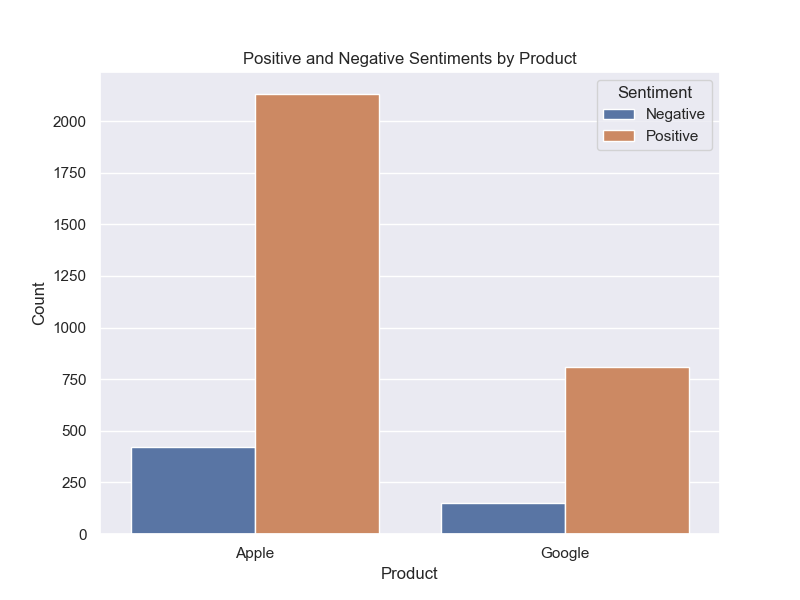

# Phase-4-Sentiment-Analysis-NLP-Project

## Project Summary

Social media is a dynamic platform where customers express their thoughts about products, services, and brands. Analyzing sentiments from social media platforms like X (formerly Twitter) provides businesses with real-time insights into customer opinions and experiences.

## Data Understanding

The objective of this project is to build a Natural Language Processing (NLP) model that rates the sentiment of tweets about Apple and Google products as positive, negative or neutral. The dataset used to build the model is sourced from CrowdFlower via data.world https://data.world/crowdflower/brands-and-product-emotions. This dataset consists of slightly over 9,000 human-rated tweets.

**Features:** prior to the preprocessing steps every row in the dataset only contains two feature columns; a string containing the full text of an individual tweet, and another string on the product being refereed to in the tweet. During preprocessing a string of tweet text will be converted inoto individual words creating more features.

**Target:** the target consists of labels (emotions) for different tweets - positive, negative, neutral and 'can't tell'. By looking at the value counts for each sentiment, a decision will be made on which of the classes to use to achieve our objectives

## Problem Statement

Sentiment Analysis provides businesses with insights into public perception of their products and services. By analyzing sentiments from tweets, companies can identify areas of concern in real-time, allowing them to address customer needs proactively.

## Business Objectives

1.	**Goal:** Train classification models to identify sentiments (Positive, Neutral, Negative) about Apple and Google Products.
2.	**Specific Objectives:**
 - Identify the distribution of negative and positive tweets by company.
 - Train, tune, and evaluate at least 3 classification models for sentiment analysis.
 - Provide the optimal model to Apple for identifying negative sentiments in future data.

 ## Requirements to Meet Objectives

1. **Load the Data**
• Use Pandas to load the dataset and inspect the data.

2. **Perform Data Cleaning with nltk**
•	Use Regular Expressions (REGEX) to remove irrelevant information such as URLs, mentions, and hashtags.
•	Convert all text to lowercase to ensure uniformity.
•	Apply lemmatization to reduce words to their base forms.
•	Remove stop words to focus on meaningful words.
•	Tokenize the cleaned text.

3. **Perform Exploratory Data Analysis**
•	Analyze positive and negative sentiments by company.
•	Visualize the distribution of sentiment labels using bar charts and value counts.
•	Visualize the top 10 most common words.
•	Create word clouds for positive, negative, and neutral tweets.

4. **Vectorize the Text Data with TFidfVectorizer**
•	 Use TF-IDF vectorizer  to convert the text data into numeric form.

5. **Iteratively Build and Evaluate Baseline and Ensemble Models**
•	Use Pipelines to build and tune Logistic Regression and Naive Bayes Models.
•	Build and train one or more ensemble models and compare results with tuned baseline models.

6. **Evaluation**
The models were evaluated using:
- `classification_report` from `sklearn.metrics`
- `confusion_matrix`

## Libraries Used

Libraries Used
1. Pandas, Numpy
•	Purpose: Data manipulation and analysis.
•	Usage: Loading datasets, cleaning data, and transforming data for analysis.

```python
import pandas as pd
import numpy as np

2. Matplotlib ans Seaborn
•	Purpose: Data visualization.
•	Usage: Creating bar charts, value counts, and other visualizations to understand class balance.

```python
import matplotlib.pyplot as plt
import seaborn as sns

3. nltk (Natural Language Toolkit) and REGEX
•	Purpose: Text preprocessing.
•	Usage: Tokenization, lemmatization, removing stop words, and text cleaning.

```python
import re
import nltk
from nltk.corpus import stopwords
from nltk.stem import WordNetLemmatizer


4. scikit-learn (sklearn),imblearn and xgboost
•	Purpose: Machine learning and model evaluation.
•	Usage: Building and evaluating models, including Logistic Regression, Naive Bayes, and ensemble models. Metrics such as classification_report and confusion_matrix.


```python
from imblearn.pipeline import Pipeline
from sklearn.pipeline import Pipeline
from sklearn.preprocessing import LabelEncoder
from sklearn.linear_model import LogisticRegression
from sklearn.naive_bayes import MultinomialNB
from sklearn.tree import DecisionTreeClassifier
from sklearn.ensemble import RandomForestClassifier, AdaBoostClassifier
import xgboost as xgb
from imblearn.over_sampling import SMOTE
from sklearn.model_selection import GridSearchCV
from sklearn.decomposition import TruncatedSVD, PCA
from sklearn.metrics import classification_report, confusion_matrix

import warnings
warnings.filterwarnings("ignore")


5. wordcloud and Counter
•	Purpose: Text visualization.
•	Usage: Creating word clouds to visualize the most common words in each sentiment class.

```python
from collections import Counter
from wordcloud import WordCloud


## Next Steps and Recommendations

### Recommendations

### 1. Sentiment Analysis and Competition Landscape




•	- **Popularity and Sentiment Balance:** Apple products are more popular but also have higher negative sentiments. Apple should monitor and address negative sentiments to maintain its market position.
•	- **Strategy for Negative Sentiments:** Apple should proactively address customer complaints by enhancing customer service, improving product quality, and engaging with users on social media.

### 2. Model Performance and Selection

 ### Evaluation of Sentiment Classification Models to Identify Positive, Neutral, and Negative Classes

Classification Report (Baseline Logistic Regression):
|   precision |   recall |   f1-score |   support |
|------------:|---------:|-----------:|----------:|
|        0.37 |     0.48 |       0.41 |    189    |
|        0.74 |     0.72 |       0.73 |   1612    |
|        0.56 |     0.56 |       0.56 |    880    |
|        0.65 |     0.65 |       0.65 |    0.65   |
|        0.56 |     0.58 |       0.57 |   2681    |
|        0.66 |     0.65 |       0.65 |   2681    |

Classification Report (Tuned Logistic Regression):
|   precision |   recall |   f1-score |   support |
|------------:|---------:|-----------:|----------:|
|        0.42 |     0.39 |       0.4  |    189    |
|        0.74 |     0.74 |       0.74 |   1612    |
|        0.57 |     0.58 |       0.57 |    880    |
|        0.66 |     0.66 |       0.66 |    0.66   |
|        0.57 |     0.57 |       0.57 |   2681    |
|        0.66 |     0.66 |       0.66 |   2681    |

Classification Report (Random Forest):
|   precision |   recall |   f1-score |   support |
|------------:|---------:|-----------:|----------:|
|        0.66 |     0.21 |       0.32 |    189    |
|        0.7  |     0.84 |       0.76 |   1612    |
|        0.6  |     0.48 |       0.53 |    880    |
|        0.67 |     0.67 |       0.67 |   0.67    |
|        0.65 |     0.51 |       0.54 |   2681    |
|        0.67 |     0.67 |       0.66 |   2681    |
 


  - Baseline Logistic Regression Model showed an overall accuracy of 65%, while the tuned Logistic Regression and Random Forest Model had an accuracy of 66% and 67% respectively. Comparing the metrics for the negative class:
  - Precision: Random Forest is better at avoiding false positives for negative tweets.
  - Recall: Baseline Logistic Regression captures a higher percentage of actual negative tweets.
  - F1-Score: Baseline Logistic Regression offers a balanced approach with better recall.

The Baseline Logistic Model is the better model for identifying the three classes, focusing on improving the recall of the Negative Class.

Sub-optimal performance can be attributed to class imbalance. Although SMOTE was used to oversample the minority class, the synthetic data did not significantly enhance model performance.

In our quest to develop a model with a higher recall for the negative class, we undertook the following steps:

o	Class Consolidation: Neutral and Positive classes combined into a new class labeled 'Other'.
o	Resampling: Built a model with a resampled subset of the new class.
o	Model Training: Trained both baseline and tuned Logistic Regression models, along with three Ensemble models.

### Evaluation of Sentiment Classification Models to Identify the Negative Class

Classification Report Baseline Logistic Regression Balanced Classes:
|   precision |   recall |   f1-score |   support |
|------------:|---------:|-----------:|----------:|
|        0.69 |     0.75 |       0.72 |    183    |
|        0.78 |     0.73 |       0.76 |    228    |
|        0.74 |     0.74 |       0.74 |    0.74   |
|        0.74 |     0.74 |       0.74 |    411    |
|        0.74 |     0.74 |       0.74 |    411    |

Classification Report Tuned Logistic Regression Balanced Classes:
|   precision |   recall |   f1-score |   support |
|------------:|---------:|-----------:|----------:|
|        0.71 |     0.73 |       0.72 |    183    |
|        0.78 |     0.76 |       0.77 |    228    |
|        0.74 |     0.74 |       0.74 |    0.74   |
|        0.74 |     0.74 |       0.74 |    411    |
|        0.75 |     0.74 |       0.74 |    411    |

Classification Report Random Forest Balanced Classes:
|   precision |   recall |   f1-score |   support |
|------------:|---------:|-----------:|----------:|
|        0.76 |     0.58 |       0.66 |    183    |
|        0.72 |     0.86 |       0.78 |    228    |
|        0.73 |     0.73 |       0.73 |    0.73   |
|        0.74 |     0.72 |       0.72 |    411    |
|        0.74 |     0.73 |       0.73 |    411    |


After evaluating the performance of the different models, it is evident that the Baseline Logistic Regression model provides the highest recall 
for the negative class at 75%, which is crucial for identifying negative sentiments accurately. The Tuned Logistic Regression model, while 
having slightly higher precision, has a recall of 73% for the negative class. The Random Forest model, although having higher precision for 
the negative class, has a lower recall compared to the Baseline Logistic Regression model.

Lower recall compared to Baseline Logistic Regression model
•Given the focus on identifying negative sentiments accurately, the Baseline Logistic Regression model with balanced classes is recommended. 
It achieves the highest recall for the negative class, ensuring a higher number of negative sentiments are accurately identified.
	

## 4.0 Next Steps

**Deploy the Selected Model:** Implement the Baseline Logistic Regression model with balanced classes into a production environment. Ensure you have a pipeline for real-time or batch processing of new tweets to classify the sentiment efficiently. This involves setting up the infrastructure, such as cloud services or servers, and integrating the model into existing systems.

**Continuous Model Monitoring and Improvement:** Establish a system to monitor the performance of the deployed model regularly. Collect feedback, track key metrics like precision, recall, and F1-score, and analyze any drifts in data or model accuracy. Schedule periodic retraining of the model with new, better labeled data to improve its performance and relevance.

**Develop a Sentiment Response Strategy:** Based on the insights derived from the sentiment analysis, create a comprehensive strategy for responding to negative sentiments identified in the tweets. This could include setting up automated alert systems for negative sentiment spikes, defining customer service protocols for addressing issues, and developing content strategies to engage with customers and improve brand perception.

These steps will ensure that the sentiment analysis model continues to deliver valuable insights and helps Apple proactively address customer concerns.


